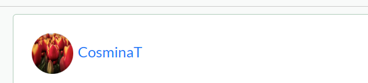
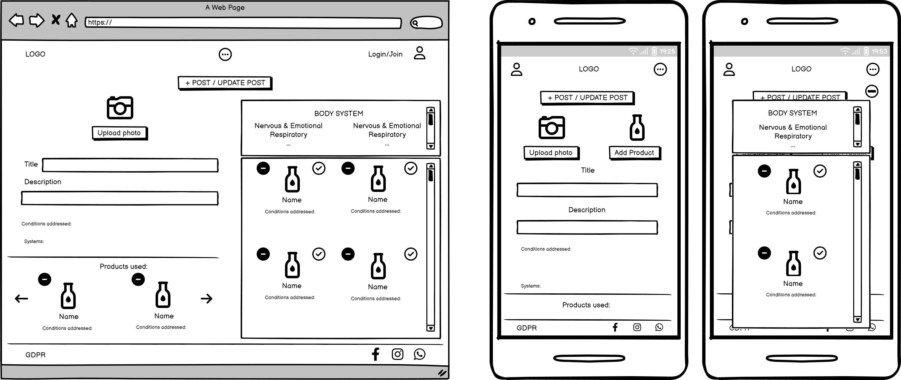
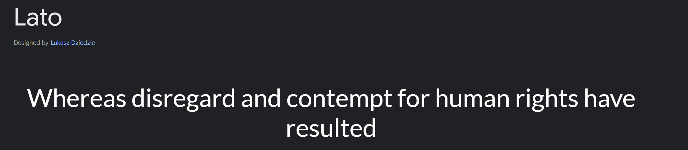
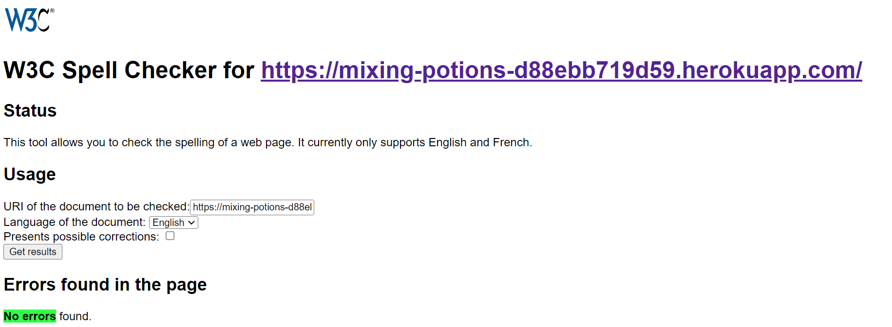

# Mixing Potions

Mixing potions was born of desire to connect people with common interest around the use of alternative medicine, and more specific essential oils through a social platform that enables them to create and share their experiences using this products in a user friendly and easy to understand manner.

The project is a continuation of my Project 3 and more specific Project 4 which touched the same topic, but in a different manner.
Website will be used by my wife to follow her passion in alternative medicine and more specific, her passion for doTTera products.

Project is connected to the backend components created in the backend portion of the project found here:

[Mixing Potions Backend](https://github.com/mtopircean/mixing-potions-backend)


## Table of Contents

- [The 5 Planes strategy](#the-5-planes-strategy)
    - [The Strategy Plane](#the-strategy-plane)
        - [Planning](#planning)
        - [Kanban Board](#kanban-board)
            - [Kanban overview](#kanban-overview)
            - [Epics](#epics)
            - [Stories](#stories)
            - [Stories prioritization](#stories-prioritization)
            - [Milestones](#milestones)
            - [Sprints](#sprints)
    - [The Scope Plane](#the-scope-plane)
    - [The Structure Plane](#the-structure-plane)
        - [Features](#features)
            - [Existing Features](#existing-features)
            - [Future Features](#future-features)
        - [Application reusable components](#application-reusable-components)
    - [The Skeleton Plane](#the-strategy-plane)
        - [Wireframes](#wireframes)
        - [Databases](#databases)
        - [Security](#security)
    - [The Surface Plane](#the-surface-plane)
        - [Theme](#theme)
        - [Colour Selection](#colour-selection)
        - [Font and text style](#font-and-text-style)
        - [Imagery](#imagery)
        - [Display size optimization](#display-size-optimization)
        - [Accessibility](#accessibility)
- [Deployment](#deployment)
    - [How do Deploy](#how-to-deploy)
    - [How to Fork](#how-to-fork)
    - [How to Clone](#how-to-clone)
    - [Heroku Deployment](#heroku-deployment)
- [Technologies](#technologies)
    - [Programming Languages](#programming-languages)
    - [Additional libraries](#additional-libraries)
    - [IDE](#ide)
    - [Other](#other)
- [Testing and Validation](#testing-and-validation)
    - [HTML](#html)
    - [CSS](#css)
    - [Lighthouse and Accessibility Test](#lighthouse-and-accessibility-test)
    - [Spellcheck](#spellcheck)
    - [ESLint](#eslint)
    - [Automated Testing](#automated-testing)
    - [Local functionality tests](#local-functionality-tests)
    - [Fixed bugs](#fixed-bugs)
    - [Open bugs](#open-bugs)
    - [Other clarifications](#other-clarifications)
- [Credits](#credits)
    - [Code Used](#code-used)
    - [Other Credits](#other-credits)
- [About Author](#about-author)

# The 5 Planes strategy

## The Strategy Plane

### Planning
Planning was done following an Agile methodology by creating 4 Sprints focused around 4 milestones. They where highly connected to each other following a natural logic in regards of timing and development steps.

Status as of 13.04.2024:

* Milestone


* Labels


* Status


* Milestone by status


* Milestone by labels


### Kanban Board
Board was designed to cover all planning aspects and offer a structured process to tackle the activities and work on my project.

#### Kanban overview
Kanban board is structured around 4 Epics connected to different functionalities, modules and stages of the project. This Epics also related to Milestones.

Status as of 13.04.2024:


#### Epics

In total we have 4 epics:
* [EPIC 1: Setup and Deployment](https://github.com/users/mtopircean/projects/15?pane=issue&itemId=52211577)- As a developer, I can install basic dependencies, create the document hierarchy/structure and deploy the application to Heroku so that the development environment is set up, and the application is accessible online for testing and use.

* [EPIC 2: Basic Social Network Features](https://github.com/users/mtopircean/projects/15?pane=issue&itemId=52215096) - As a developer, I can implement user authentication, profile and post creation, so that users can create basic content on the social network.

* [EPIC 3: Extended Features](https://github.com/users/mtopircean/projects/15?pane=issue&itemId=52217119) - As a developer, I can implement following system, liking and commenting functionality, and enable sharing content on social media, so that users can engage actively with the content and other users on the social network.

* [EPIC 4: Create documentation](https://github.com/users/mtopircean/projects/15?pane=issue&itemId=52219838) - As a developer, I can create README documentation, develop tests and document them so that I can provide suitable information related to how the website was developed and tested to outside sources.

#### Stories

You can find the story list here: [STORIES](https://github.com/mtopircean/mixing-potions-frontend/issues)

Attached to the 4 epics I`ve created approximately 11 stories structured around various prioritization methods:
* Milestones
* Sprints
* Importance priority
* Story points
* Kanban category:
    * To Do : Stories to be worked on but not allocated to a priority section
    * In Progress: Stories being worked on
    * Done: Stories completed
    * Closed: Stories with all tasks closed and closure is validated
    * Nice to do: Future developments
    * Should do: If time allowed, still to be done
* Epics:
    * Epic 1: 3 stories
    - EPIC 1: Setup and Deployment- follows the needed steps to deploy the work enviorement and applicaiton
        - **[User Story: 1.1 Install and Configure basic dependencies](https://github.com/users/mtopircean/projects/15?pane=issue&itemId=52213305)** - As a developer, I can install all the necessary dependencies for my application so that the software can run both in development and production environments.
        - **[User Story: 1.2 Deploy to Heroku](https://github.com/users/mtopircean/projects/15?pane=issue&itemId=52213685)** - As a developer, I can deploy the application to Heroku so that it is accessible online for testing and live use.
        - **[User Story 1.3: Create Document Hierarchy and Structure](https://github.com/users/mtopircean/projects/15?pane=issue&itemId=52214425)** - As a developer, I can create a document hierarchy and structure for the project well organized and structured.

    * Epic 2: 2 stories 
    - Epic 2: Basic Social Network Features - focused on the essentials needed for a social network to function
        - **[User Story 2.1: User Authentication and Profile Creation](https://github.com/users/mtopircean/projects/15?pane=issue&itemId=52215694)** - As a user, I can securely register, log in, and edit my profile so that can personalize my experience and manage my information on the platform.
        - **[User Story 2.2: Post Creation](https://github.com/users/mtopircean/projects/15?pane=issue&itemId=52216237)** - As a user, I can create posts with titles, text descriptions, images, and select products so that I can express myself and showcase my product interests to the social network community.

    * Epic 3: 3 stories
    - Epic 3: Extended Features - other features that will enhance the social network experience
        - **[User Story 3.1: Following System](https://github.com/users/mtopircean/projects/15?pane=issue&itemId=52217833)** - As a user, I can follow and be followed by others so that I can personalize my feed with updates from users I'm interested in.
        - **[User Story 3.2: Liking and Commenting on Posts](https://github.com/users/mtopircean/projects/15?pane=issue&itemId=52218260)** - As a user, I can like and comment on posts so that I can engage with content by appreciating and providing feedback.
        - **[User Story 3.3: Sharing Content on Social Media](https://github.com/users/mtopircean/projects/15?pane=issue&itemId=52218826)** - As a user, I can share my posts on social media platforms so that my content can reach a larger audience connected to the major social networks. 

    * Epic 4: 3 stories
    - Epic 4: Create documentation - documentation for the development process and application guidelines
        - **[User Story 4.1: Create README File](https://github.com/users/mtopircean/projects/15?pane=issue&itemId=52220343)** - As a developer, I can create a README file so that administrators and developers have a clear understanding of the website's purpose, setup, development process and functionality.
        - **[User Story 4.2: Create Testing Plan, Perform Testing](https://github.com/users/mtopircean/projects/15?pane=issue&itemId=52221401)** - As a developer, I can create a testing plan and perform testing so that all features work as expected under various situations and scenarios.
        - **[User Story 4.3: Create TESTING Document](https://github.com/users/mtopircean/projects/15?pane=issue&itemId=52221813)** - As a developer, I can create a TESTING document so that detailed information on the testing plan, coverage, and outcomes is available for review.

All user stories where completed and closed, the only ones remaining would be the stories allocated in the Nice to do.

* Nice to do:
    * **[User Story 3.3: Sharing Content on Social Media](https://github.com/users/mtopircean/projects/15?pane=issue&itemId=52218826)**

Stories where then broken down into a structure that allowed for Acceptance criteria to be defined, as well as the story to be broken down in tasks in order to follow a systematic development, as well as a way to track progress.

Please find bellow an example of a story:


#### Stories prioritization
My goal in the development of the project was to deploy an Agile methodology, allocating importance on the strategic prioritization of user stories. This involved aligning tasks to optimize delivery, considering dependencies, user expectations, and business scope. 

There where 3 main categories of points:
* 3 points: middle complexity/middle effort, which in essence where the first effort allocated and became the control level
* 2 points: lower complexity/lower effort stories
* 5 points: higher complexity/higher effort

Ex: Based on this prioritization framework, the following sequence outlines the order in which the user stories would have been addressed:

* Install basic dependencies (2 story points)
* User Authentication and Profile Creation (5 story points)
* Testing (5 story points)
* README (5 story points)
* ... (etc. ......)

A second system of prioritization was allocating a complexity label...which connected well with the story points system.

Thirdly, milestones and sprints also played a crucial role in prioritizing my stories and keeping control on the timing of my project.

Example of label allocation:


#### Milestones
4 Milestones where created and structured around key steps in the development process, and around a well balanced timing:


#### Sprints
4 sprints where considered, also closely connected to the milestones, having the same logic behind their setup.

## The Scope Plane
This website was created with a key element in mind, to create a platform that allows users to better understand the products, share their experiences and create connections within the community
* Share experiences in posts recommending products and how they where used
* Understand how the products can be used, what they are used for
* Seach and find solutions for their conditions

For the website owner, the key focus point is to provide value to the user through various methods:
* Clear targeted, easy to understand and access solutions to user problems
* Satisfy the community needs of the users
* Offer an easy to understand, friendly and attractive user interface

## The Structure Plane
Structure and features of the website are organized around 2 concepts, concepts set in order to provide value to both the user and owner:
* Owner friendly - Backend connected
    * Easy to manage(as automated as possible):
        - key feature being the import-export function
    * Upgradable and scalable with ease
        - the reuse of different elements within pages(navbar, filter options, like, comment, follow, product panel)
* User friendly
    * Easy to navigate 
    * Key elements always on, like footer, WhatsApp contact
    * Easy to use filter section
    * Important information present in key areas of the pages, with elements easily identifiable and visible
    * Mobile friendly: taking advantage of the power of bootstrap

### Features

#### Existing Features

- **User authentication and profiles**: User can login, access their profile, update the profile with additional details not present in the current form, but which can provide more details to the community. Profile section also offers access to various data around followed users and own posts.
**Addressed in [User Story: 2.1](https://github.com/users/mtopircean/projects/15?pane=issue&itemId=52215694)**

- **Post creation with product integration**: Users can create posts by uploading their own picture, but within the post they can select to include products based on a filter criteria. Products information is used to define specific areas within a post by concatenating data
**Addressed in [User Story: 2.2](https://github.com/users/mtopircean/projects/15?pane=issue&itemId=52216237)**

- **Follow**: User can follow and unfollow other users, with follow status being pulled into own profile for better management system
**Addressed in [User Story: 3.1](https://github.com/users/mtopircean/projects/15?pane=issue&itemId=52217833)**

- **Like**: User can like or unlike posts from various areas of the website(post list and post page)
**Addressed in [User Story: 3.2](https://github.com/users/mtopircean/projects/15?pane=issue&itemId=52218260)**

- **Comment**: Users can comment, edit or delete a comment either from the front page, from the posts area or straight into each post
**Addressed in [User Story: 3.2](https://github.com/users/mtopircean/projects/15?pane=issue&itemId=52218260)**

- **Search section**: Users can search other posts in posts page by a multitude of criteria(condition, body system, username, description, title, etc.)
- **Most Liked Users**: Using a refresh system, user can see the most liked users
- **Posts filtering**: User can search posts by body systems in the main posts page
- **Notifications**: Implemented toasts through the various areas of the website in order to highlight to the user effect of key actions
- **Non-conforming content**: Alerts are set through specific areas of the project in order to highlight to the user where content is not conformant to the backend set conditions

#### Authentication


**Related pages: LoginForm.js, RegisterForm.js**

Registration
Logged out user:
-   can access the login area through the Navbar
-   user is redirected to the login area or registered


Logged in user:
-   Navbar status changes for the user where they have the option to logout


#### Profiles

**Related pages: ProfilePage.js, ProfilePage.js(used to edit and add further profile details), ChangeUsername.js, ProfilePasswordChange.js**

User can access their profile page through the Navbar section and using the login form.
Profile allows him access to areas:
-   Personal details and data management areas
-   Followed users area
-   Own Posts area


If user is not logged in, by clicking a username, the username personal details are visible but the restricted owner areas are not shown of accessible.
User can also see the owner`s profile personal posts.


When using the profile page users can change key profile elements: further share data on their profile, change username and password through the relevant pages.

#### Post creation & Edit Post

**Related pages: Post.js, PostCreateForm.js, PostEditForm.js, PostPage.js, PostsPage.js**


Post creation and edit feature are available only when logged in.
If user is not logged in, all restricted pages will be redirected to homepage.
From this page, user can make use of the product panel feature in order to create a post.
If a user wants to edit their own post, edit area is pre-populated with existing post data.
Alerts and Toasts are set to guide user on their actions/confirm or highlight issues or success.
Post Creation is allowing a concatenating process of the Body Systems and Conditions of the products used in a post.


#### Follow

**Reusable component: Follow.js**

User can follow another user from their profile.
They can unfollow a user by either going straight in their own profile, or clicking following from the followed users profile, which will redirect them to the unfollow area


#### Like

**Reusable component: Like.js**

User can like a post either from the main posts page or from the individual post page.
They will unlike through the same areas.
Toasts will prompt each action.

Like general:


Like post page:


#### Comment

**Reusable component: CreateComment.js**

User can comment the same, from the general post page or from individual post page.
When logged out, users can only see the comment, but when logged in they can create, update, edit or delete.
Toasts will prompt the users on their actions

Comment general:


Comment post page:


#### Search

Users can use the search criteria in the main page in order to allow them to search posts by various filters like: username, products used, conditions and body systems, description and title.
The refresh is done automatically when typing in the search criteria


#### Most Liked

Most Liked is currently using a manual refresh system due to it`s limitations.
It is visible top in desktop mode and bottom of page in mobile. This is done as personal choice at this stage to keep a specific flow of the page.


#### Filtering

Filtering is done through the Body Systems area or by most liked users, in addition to the search bar.
Multiple selections are available only for the Body Systems.


#### Notification & Non-conforming content

Alerts are set for the input fields area in the various forms implemented(registration, profile editing areas, post create/edit page).
Toasts are also used to give responses to users based on their actions.
Image upload conditions where set in the front page and response to user was given through toast for this specific section

Toasts:


Alerts:


#### Products panel

**Reusable component: ProductsPanel.js**

A products panel was implemented to support the Post Creation action.
This pulls the existing product database and allows a filtering system based on the body systems where the product is used.


#### Future Features

Future features include:

-   ability to share posts on main social media
-   ability to add and edit products from front-end
-   ability for users to create communities as we as having an integrated chat system
-   Most Liked will be able to refresh itself with each click of the Like/Unlike button
-   Automated avatar and ranking change based on set specific logic: at the moment, it is done manual by the website administrator
-   Posts maintain data when refreshed

### Application reusable components

- **Asset**
The Asset component is crucial for displaying images with an optional loading spinner. It accepts src and message props to specify the image source URL and alternative text respectively. While the image is loading, a spinner from React Bootstrap is shown.


Component is reaused across the application to provide the user guidance on page load.

- **Avatar**
The Avatar component serves to display user avatars. It allows for customization with props such as src for the image source URL, height for setting the height of the avatar (default is 45 pixels), alt for alternative text, and className for additional styling.



Used across the application in several areas like NavBar, Post and ProfilePage to add the the Avatar image allocated based on user rating.

- **BodySystemPanel**
This component is essential for managing selected body systems and filters. It utilizes React hooks like useState and useEffect to handle state and side effects. It fetches product data from an API endpoint using Axios and allows users to select and remove filters based on body systems, displaying them in a container with clear buttons for removal. Additionally, it provides buttons for selecting body systems, dynamically rendering based on the fetched data.


Component is used in 2 key areas of the application, within the PostsPage to allow filtering on posts and within the PostCreateForm/PostEditForm to allow products filtering for selection in post update/creation.

- **CreateComment**
The CreateComment component facilitates comment creation and editing within the application. It employs React hooks such as useState and useEffect to manage the state of the comment text, current user, and editing mode. This component communicates with the server using Axios to submit and update comments. It offers a form interface with a textarea for users to input their comments and handles submission, error handling, and validation for empty comments. Toast notifications provide user feedback, and it offers options to cancel editing with dynamic UI adjustments.


Connected to the Post page and other pages using the Post elements to render data.

- **Follow**
The Follow component is used for managing the follow/unfollow functionality. Utilizing React hooks like useState and useEffect, it handles state and side effects, including fetching data from the server with Axios. This component dynamically determines whether the current user is already following the target user and adjusts the UI accordingly. It offers a button for users to follow or unfollow other users, accompanied by toast notifications for user feedback.


Connected to the ProfilePage rendered specifically based on the CurrentUser context.

- **Footer**
The Footer component contains various links and icons for navigation and social media interaction. Using React Bootstrap's components, it structures the layout and includes links to the GDPR page, a "Join Us" link with a FontAwesome icon, and social media icons linked to their respective pages. These links open in new tabs and are styled appropriately for user interaction.


Displayed on all pages.

- **Like**
The Like component manages the liking and unliking functionality for posts. It utilizes React hooks like useState and useEffect to handle state and Axios for server communication. It provides feedback to users through toast notifications for actions such as liking, unliking, and authentication requirements.


Connected to the Post page and other pages using the Post elements to render data.

- **Navbar**
The Navbar component is the application's navigation bar, providing access to various functionalities and pages. It utilizes React Bootstrap components for structured navigation elements and includes a logo that either reloads the current page or navigates to the home page. Depending on the user's authentication status, it renders different icons and links, with a collapsible menu for additional navigation options.


Displayed on all pages.

- **PostCreator**
The PostCreator component serves as a button for creating a post. It links to the post creation page with React Router's NavLink component. Conditionally rendered based on the authentication status, it ensures only authenticated users can access post creation functionality.


Displayed on all pages based on the CurrentUser Context status.

- **ProductPanel**
The ProductPanel component displays a panel of backend products. It fetches and filters products based on selected body systems, rendering each product as a card with options to add them to a post. It utilizes React Bootstrap components for layout and Axios for server communication.


Used within the PostCreateForm and PostEditForm page to allow product selection for post creation.

## The Skeleton Plane
### Wireframes
To support both the functionality and the design part of the website, following wireframes where created.
Slight deviations have happened during the development process, but overall the main and majority of design direction has been kept.

* Account Page


* Create/Update Post Page



* Post Page


* Main Posts Page

Logged out


Logged in


* Register/Login Page


* GDPR, Update Profile/Password/Username Page: basic simple design where wireframes where not needed as in general terms they followed the same logic as the others

### Databases

Database data is present as part of the backend readme.

[Mixing Potions Backend](https://github.com/mtopircean/mixing-potions-backend)

### Security

Various conditional render processes where implemented through the project that restrict the user in seeing and accessing various data.
For example, in the ProfilePage, access to pages that edit the profile data are not visible and can not be accessed by the users that do not own the profile:
```
  {currentUser &&
                                currentUser.username === profile.username &&
```

Similar used in PostPage:
```
<div className="arrow-button">
            {isCurrentUserOwner && (
              <Button
                onClick={handleEdit}
                className={styles["post-edit-button"]}
              >
                Edit <FontAwesomeIcon icon={faPenSquare} />
              </Button>
            )}
            {isCurrentUserOwner && (
              <Button
                onClick={confirmDelete}
                className={styles["post-delete-button"]}
              >
                Delete <FontAwesomeIcon icon={faTrashAlt} />
              </Button>
            )}
          </div>
```

Generally, the current user context was used across the code to render or not specific content.

The useRedirect hook was used across the code to ensure users logged out where redirected from a specific page if they where not logged in. Ex in PostCreateForm:

```
function PostCreateForm() {
    useRedirect('loggedOut');
```

Non existent pages where handled through the Page Not Found route:

```
<Route render={() => <p>Page not found!</p>} />
```

## The Surface Plane
### Theme
When considering the website theme the general idea was to provide a clean, modern look, but maintain also a good level of elegance.
This was achieved through a well though colour selection, limitation on number of elements displayed, and a high use of bootstrap to allow proper alignment and element display in the page.
General aim was for a clean design, easy to read, understand, with all elements easy to access and read.

### Colour Selection
Colours where selected in line with the theme, but also to offer a high level of accessibility and contrast. It has suffered several changes during the development process as I`ve tried to maintain data clear, easy to read and print. The choice was also due to the amount of features present on the website and the interest to create a separation, or a unique identifier to separate them visually.

Generally I`ve tried to use a consistent palette of colours, suitable for the various areas of the website and message sent.
List of the most colours used:


### Font and text style
Text and font used are consistent across the website with variances in regards of decoration and size. Font used was selected from Google Fonts:


### Imagery
Logo was designed using Canva website.
Photos for website elements are taken from Pexels.
Product and promotion photos are taken from doTerra database/representative tools.

### Display size optimization
The use of Bootstrap has limited significantly the level of manual intervention I had to do in order to adapt the layout to various screen sizes.
My intervention was limited to an intervention on this two particular sizes, which managed to adapt to all screen variations under them:

``` css
@media (max-width: 768px)
```
``` css
@media (max-width: 767px)
```
``` css
@media (max-width: 991px)
```
``` css
@media (min-width: 992px)
```

### Accessibility
From an accessibility perspective, my goal was to create a clean website with data easy to read, positioned in a relevant manner for the user. I`ve achieved this by:

Writing semantic HTML
Correct selection of text size, font and style in order to contrast well with the other elements of the page.
Highly visible and relevant logo.
Use of alt attribute connected to the logo.
Another area I was mindful of, was that all of the consideration above where not lost when using the website in smaller screen sizes.

Display size optimization:


# Deployment
## How to Deploy
Deployment of the website was done using HEROKU, and can be accessed here [Mixing Potions](https://mixing-potions-d88ebb719d59.herokuapp.com/).

## How to Fork
To fork the repository:

1. Log in (or sign up) to GitHub.
2. Go to the repository for this project, [mtopircean/mixing-potions-frontend](https://github.com/mtopircean/mixing-potions-frontend)
3. Click the Fork button in the top right corner.

## How to Clone
To clone the repository:

1. Log in (or sign up) to GitHub.
2. Go to the repository for this project, [mtopircean/mixing-potions-frontend](https://github.com/mtopircean/mixing-potions-frontend)
3. Click on the code button, select whether you would like to clone with HTTPS, SSH or GitHub CLI and copy the link shown.
4. Open the terminal in your code editor and change the current working directory to the location you want to use for the cloned directory.
5. Type 'git clone' into the terminal and then paste the link you copied in step 3. Press enter.

### Heroku Deployment
The project was deployed to [Heroku](https://heroku.com).
Deployed site can be found [Here](https://mixing-potions-d88ebb719d59.herokuapp.com/).
To deploy, follow this steps:

1. Create an account at https://heroku.com and login. 


2. Create a new app from the [Heroku dashboard](https://dashboard.heroku.com) by clicking on `New` and then on `Create new app`.


3. Create a unique name for your app.


4. Choose your region (US or Europe).


5. Select the **Deploy** tab and connect the Heroku app to your GitHub repository.


6. Scroll down and choose the branch you want to deploy in the *Manual deploy* section. Click **Deploy Branch** for your first deployment.


7. Select **View** to open your deployed app.


8. If you encounter issues, use **More** and then **View logs** or check the **Activity** tab for debugging.


# Technologies
## Programming Languages
1. HTML
2. CSS
3. JavaScript
4. JSX
5. React

## Additional libraries
- Axios: API requests
- Bootstrap and React Bootstrap: design layout
- React Router: routing
- React Infinite Scroll Component: infinite scroll
- JWT Decode: decoding JSON Web Tokens
- Jest and React Testing Library(including user-event): automated testing
- js-cookie: handles browser cookies
- react-icons: implement react specific icon libraries
- react-toastify: Implement toast
- Prettier: format code

## IDE
1. GitHub: to store the source code.
2. GitPod: support to write majority of code, deploy via Heroku, and push data to store in GitHub. Gitpod was used also for debugging purposes.
3. Git: Used to push code

## Other
1. HEROKU: to deploy application and act as the app interface
2. ESLinter: to validate code format.
3. Dalle: support with logo creation.
4. Font Awesome: support with icon for various html pages
5. Google Font: support with font style used for website text.
6. Balsamiq: support with wireframe creation.
7. Google DevTools: support with CSS styling, troubleshooting and responsive design development; support with testing function execution/js functionality.
8. Lighthouse: performance testing .
9. W3C Spell Checker: webpage spelling checks.
10. WAVE Web Accessibility Evaluation Tools: for accessibility evaluation.
11. CSS Validation Service: for CSS code evaluation and troubleshooting.
12. W3C Markup Validation Service: for HTML code evaluation and troubleshooting.
14. Colours: to create palette of colours in README.
15. Amiresponsive: to create a snapshot of the page responsiveness on different screen variations

# Testing and Validation
## HTML

Index file tested through the W3C Validator.
Warnings about trailing slashes are due to the structure of the index.html file generated by Create React App and can be ignored:


## CSS

Code tested without any errors found:

- App
- BodySystemPanel.module
- CreateComment.module
- Follow.module
- Like.module
- LoginRegisterPage.module
- Post.module
- PostCreateForm.module
- PostCreator.module
- PostPage.module
- PostsPage.module
- ProductPanel.module
- ProfileEditForm.module
- ProfilePage.module
- ProfilePasswordChange.module


## Lighthouse and Accessibility Test
Accessibility and performance where tested with Lighthouse.
Generally good results with lower performance in mobile version on specific pages.

Test results:

- Posts Page

Desktop:


Mobile:


- Login Page:

Desktop:


Mobile:


- Register Page:

Desktop:


Mobile:


- Post Page:

Desktop:


Mobile:


- Profile Page:

Desktop:


Mobile:


- GDPR:

Desktop:


Mobile:


## Spellcheck:
Website run through W3C spellchecker. No errors found:



## ESLint:
No Lint errors found in the code:
RA has ESLint built in, and all errors coming up in the terminal where addressed.
ESLint was installed separately and no errors had to be addressed.


## Automated Testing:
Basic automated testing put in place to test the following:

- PostsPage.test.js

1. Verifies rendering of posts.
2. Validates rendering of the body system panel.
3. Ensures rendering of the most liked users panel.
4. Checks if the "Follow" button is displayed only when the user is logged in.

- RegisterForm.test.js

1. Verifies the rendering of the RegisterForm component.
2. Tests submission of the registration form with valid data.
3. Ensures that an error message is displayed if registration fails.

- Navbar.test.js

1. Ensures the presence of the logo in the NavBar component.
2. Validates the existence of the "Join/Login" link in the NavBar.
3. Verifies the rendering of the navigation component in the NavBar.

- LoginForm.test.js

 1. Checks that submitting the login form with valid credentials.
 2. Redirects the user to the designated page.

- App.test.js

1. Verifies that the "Join/Login" link is rendered within the App component.

- PostCreateForm.test.js

1. Ensures that essential input forms, such as title, description, and buttons, are rendered within the PostCreateForm component.

All test run successful with pass as a result:


## Local functionality tests

All local/manual tests can be found bellow:

[TESTING.md](https://github.com/mtopircean/mixing-potions-frontend/blob/main/TESTING.md)

## Fixed Bugs

1. Logout functionality not working properly only after multiple attempts.
Takes a few refreshes of the page to be able to logout.
Traced to the order of events being triggered.

Solution add in Navbar a prevent default item:
```
const handleLogout = async (event) => {
        event.preventDefault();
        try {
            await axios.post('/dj-rest-auth/logout/');
            setCurrentUser(null);
            removeTokenTimestamp();
        } catch (error) {
            console.error('Logout error:', error);
        }
    };
```
2. Several issues due to pagination in PostsPage and in ProductPanel.

Both solved in different manners:

```
const fetchLikeCounts = async () => {
        try {
            const likeCounts = {};
            let currentPage = 1;
            let hasNextPage = true;

            while (hasNextPage) {
                const { data } = await axiosReq.get(
                    `/posts/?page=${currentPage}`
                );
                data.results.forEach((post) => {
                    const owner = post.owner;
                    const likeCount = post.like_count;
                    if (likeCounts[owner]) {
                        likeCounts[owner] += likeCount;
                    } else {
                        likeCounts[owner] = likeCount;
                    }
                });
                if (!data.next) {
                    hasNextPage = false;
                }
                currentPage++;
            }

            setLikeCounts(likeCounts);
        } catch (err) {
            console.log(err);
        }
    };
```

```
const fetchAllProducts = async () => {
      let allProducts = [];
      let nextPageUrl = "products";
    
      try {
        while (nextPageUrl) {
          const response = await axios.get(nextPageUrl);
          allProducts = [...allProducts, ...response.data.results];
          nextPageUrl = response.data.next;
        }
    
        setProducts(allProducts);
      } catch (error) {
        console.error("Error fetching products:", error);
      }
    };
```

## Open Bugs

1. Refresh on create or edit post, or other forms does not maintain the changes made and in the case of create posts it redirects the user to homepage. It is not really an error, but more a limitation on my application that I intend to address in a future iteration.

2. Menu shift when user logged in:
Due to some scaling issue, when I login, the menu icon shifts slightly up


3. 401 errors:
Standard errors when opening the app without being logged in


4. Multiple refresh:

If I refresh a page multiple times when logged in, in some cases, the error bellow is received:


Discussing with the tutoring team seems to be an ElephantSQL issue.

5. Error after page with form data stays idle for a few minutes:

If I stay on a specific form, for ex. PostCreateForm for 3-5 minutes, when I try to submit I receive this error:
POST https://mixing-potions-drf-api-0a8cbdf11dd2.herokuapp.com/posts/ net::ERR_CONNECTION_RESET

Discussing with the tutoring team seems to he a Heroku issue.

6. Comment update submission:
After updating a comment, user needs to refresh the page to be able to edit the comment again.
This is a limitation that will be addressed in future iterations:


7. Although I have a very difficult time in replicating the error, on certain ocassions, even if I follow already a user, I can follow them again and are displayed twice in my followed list.
I believe it has to do with the loading of the website....but it happens in very rare ocassions. Doesn`t affect functionality and I can unfollow the user, but it is just creating this duplication.

8. Not really a BUG, but I have to run nvm install 16 before I can run a npm start to run a server. Something to do with version control, but could not fix it and tutoring recommandation was to do nvm install 16 so I can be able to start the server.

9. Due to issues in styling elements of navbar, I had to leave 1 styling in App.css:
```
.dropdown-toggle::after {
  color: #272c4f;
}
```
and add some styling code in JSX in NavBar:
```
<style>
    {`
        .dropdown-menu.show {
            border: none;
        }
    `}
</style>
```


## Other clarifications

- Website was tested on various browser and mobile devices(Chrome, IE, Firefors, Edge, Android) and noticeable difference around various elements like scroll bar, etc....but nothing impating user experience or a deviation to the design statement.
- Due to issues in styling elements of navbar, I had to leave 1 styling in App.css:
```
.dropdown-toggle::after {
  color: #272c4f;
}
```
and add some styling code in JSX in NavBar:
```
<style>
    {`
        .dropdown-menu.show {
            border: none;
        }
    `}
</style>
```


# Credits

## Code Used

I`ve tried a lot during development to user alternative and creative ways deviating from the Moments Projects.
In majority of cases my code is different, following various other routes.
There are certain elements that are heavy reliant and similar to the Moments project like:
- useRedirect.js
- axiosDefault.js
- CurrentUserContext.js
- handlers.js
- utils.js

Certain others still use the Moments structure, but adapted to my project.

## Other Credits
* Inspiration on readme structure taken from kera-cudmore repo`s and following the article written by her on how to write a readme.
* Thanks to Mo Shami, my mentor for all his support during the development of the project.
* Thank you to the CI Tutor Team who supported in several instances by providing guidance on overcoming various challenges encountered during development. Great support as always :).

# About Author
Marius Topircean is an aspiring software-developer on a journey to develop and learn his place into the developer community.

My contact details are:

Email: mtopircean@yahoo.com

Phone: +353857642212

Slack: Marius Topircean

GitHub: mtopircean

LinkedIn: [Marius Topircean](https://www.linkedin.com/in/marius-t-7b5592124)

